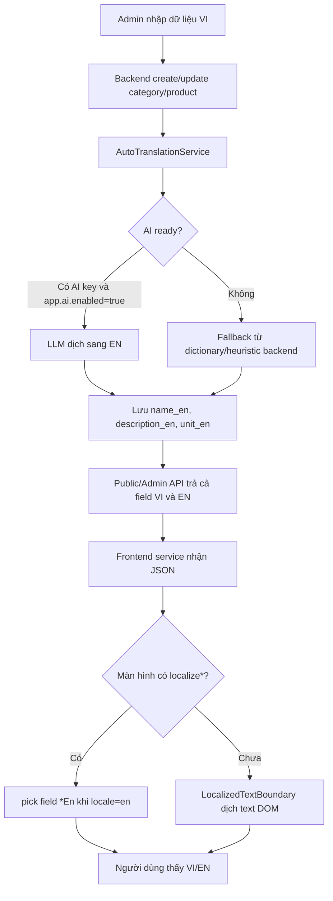

# Tài liệu triển khai build song ngữ Việt - Anh cho AgriMarket

Tài liệu này tổng hợp toàn bộ luồng song ngữ hiện có trong dự án `agri-ecommerce`, gồm frontend Next.js, backend Spring Boot, database, AI translation, AI chat, build/deploy và checklist QA.

Ngày rà soát: 2026-07-02.

## 1. Mục tiêu song ngữ

Dự án đang hướng tới mô hình song ngữ `vi` và `en` theo 2 lớp:

1. Text giao diện: nhãn nút, tiêu đề, thông báo, placeholder, alt/title/aria-label.
2. Dữ liệu nghiệp vụ: tên/mô tả/đơn vị sản phẩm, tên/mô tả danh mục, tên sản phẩm trong giỏ hàng, wishlist, đơn hàng và gợi ý AI.

Hiện trạng không phải là routing song ngữ theo URL như `/vi/products` và `/en/products`. Frontend dùng một language switcher cố định, lưu lựa chọn vào `localStorage`, đổi `document.documentElement.lang`, đổi `document.title` sau hydration, sau đó dịch UI ngay trong browser.

## 2. Kiến trúc tổng quan



Các file chính:

| Lớp | File |
| --- | --- |
| Root app song ngữ | `agri-ecommerce-frontend/src/app/layout.js` |
| Bọc client i18n | `agri-ecommerce-frontend/src/components/I18nClientRoot.jsx` |
| Context ngôn ngữ | `agri-ecommerce-frontend/src/i18n/language-provider.jsx` |
| Dịch text DOM | `agri-ecommerce-frontend/src/i18n/localized-text-boundary.jsx` |
| Dictionary UI | `agri-ecommerce-frontend/src/i18n/phrase-dictionary.js` |
| Chọn field `*En` | `agri-ecommerce-frontend/src/i18n/localized-fields.js` |
| Switcher VI/EN | `agri-ecommerce-frontend/src/components/LanguageSwitcher.jsx` |
| DB migration field EN | `agri-ecommerce-backend/src/main/resources/db/migration/V5__add_english_localized_fields.sql` |
| Bảo vệ schema runtime | `agri-ecommerce-backend/src/main/java/com/agri/ecommerce/config/LocalizedFieldSchemaInitializer.java` |
| Entity sản phẩm/danh mục | `ProductEntity.java`, `CategoryEntity.java` |
| DTO request/response | `ProductCreateRequest.java`, `ProductResponse.java`, `CategoryCreateRequest.java`, `CategoryResponse.java` |
| Mapper response | `ProductMapper.java`, `CategoryMapper.java`, `CartMapper.java`, `WishlistMapper.java`, `OrderMapper.java` |
| Auto dịch backend | `AutoTranslationService.java`, `AutoTranslationServiceImpl.java` |
| AI chat theo locale | `AiChatWidget.jsx`, `AiChatRequest.java`, `AiChatServiceImpl.java`, `AiProductContextService.java` |

## 3. Luồng frontend hiện tại

### 3.1 Root layout

`agri-ecommerce-frontend/src/app/layout.js`:

- `metadata.title` và `metadata.description` mặc định là tiếng Việt.
- `<html lang="vi">` mặc định tiếng Việt.
- `suppressHydrationWarning` được bật vì client sẽ đổi `lang`, `title` sau hydration.
- Toàn bộ app được bọc bởi `<I18nClientRoot>`.

Điểm cần nhớ:

- SEO metadata server-side vẫn là tiếng Việt.
- Tiếng Anh chỉ được áp sau khi client hydrate.
- Nếu cần SEO tiếng Anh thật, nên chuyển sang locale routing hoặc generate metadata theo locale.

### 3.2 I18nClientRoot

`I18nClientRoot.jsx` bọc app theo thứ tự:

```jsx
<LanguageProvider>
  <LocalizedTextBoundary />
  {children}
  <AiChatWidget />
  <LanguageSwitcher />
</LanguageProvider>
```

Ý nghĩa:

- `LanguageProvider` giữ state ngôn ngữ.
- `LocalizedTextBoundary` quét toàn bộ `document.body` để dịch text.
- `AiChatWidget` đọc `locale` để gửi lên backend.
- `LanguageSwitcher` cho user đổi `vi`/`en`.

### 3.3 LanguageProvider

`language-provider.jsx`:

- Storage key: `agrimarket_locale`.
- Default locale: `vi`.
- Supported locales: `["vi", "en"]`.
- API exposed qua hook `useLanguage()`:
  - `locale`
  - `isEnglish`
  - `setLocale(nextLocale)`
  - `toggleLocale()`
  - `t(text)`

Luồng runtime:

1. Render đầu tiên dùng `vi`.
2. Sau hydration, đọc `localStorage.agrimarket_locale`.
3. Normalize locale. Nếu không phải `vi` hoặc `en` thì fallback `vi`.
4. Ghi `document.documentElement.lang = locale`.
5. Ghi `document.title` theo locale.
6. Lưu lại locale vào localStorage.
7. Dispatch event `agrimarket-language-changed`.

### 3.4 LocalizedTextBoundary

`localized-text-boundary.jsx` là lớp dịch toàn cục.

Cách hoạt động:

- Dùng `MutationObserver` theo dõi text node và attribute.
- Dịch text node nếu node có nội dung.
- Dịch các attribute: `placeholder`, `title`, `aria-label`, `alt`.
- Bỏ qua vùng có:
  - `script`
  - `style`
  - `code`
  - `pre`
  - `textarea`
  - `[data-no-translate]`

Khi locale là `vi`:

- Trả text về bản gốc đã lưu trong `node.__agriOriginalText`.

Khi locale là `en`:

- Gọi `translateText(originalText, "en")`.

Rủi ro:

- Đây là giải pháp client-side, không tốt cho SEO tiếng Anh.
- Có thể dịch cả text dữ liệu động ngoài ý muốn nếu text đó trùng pattern dictionary.
- Với text chưa có dictionary/fallback, tiếng Việt vẫn có thể còn lại.
- Text sinh sau render sẽ được observer xử lý, nhưng vẫn phụ thuộc chất lượng `phrase-dictionary.js`.

### 3.5 Phrase dictionary

`phrase-dictionary.js` có 4 lớp dịch:

1. `exactTranslations`: dịch chính xác toàn câu/cụm.
2. `additionalTranslations`: bổ sung cho admin, checkout, profile, AI chat, promotions.
3. `termTranslations`: dịch thuật ngữ rời như `sản phẩm`, `đơn hàng`, `trạng thái`.
4. `patterns`: dịch câu động bằng regex, ví dụ số lượng, trạng thái, thông báo tạo/xóa/cập nhật.

Sau đó có fallback:

- Detect tiếng Việt có dấu bằng Unicode pattern.
- Strip dấu tiếng Việt.
- Thay segment phổ biến trong `fallbackSegmentTranslations`.
- Giữ proper noun nếu giống tên riêng.
- Nếu vẫn không dịch được thì trả lại text gốc để tránh placeholder vô nghĩa.

Quy tắc thêm text UI mới:

1. Viết text gốc bằng tiếng Việt.
2. Nếu text cố định, thêm vào `exactTranslations` hoặc `additionalTranslations`.
3. Nếu text có biến, thêm pattern regex vào `patterns`.
4. Nếu là thuật ngữ xuất hiện nhiều, thêm vào `termTranslations`.
5. Nếu là tên sản phẩm/danh mục phổ biến, thêm vào `fallbackSegmentTranslations` nhưng không nên lạm dụng.

### 3.6 Localized fields

`localized-fields.js` xử lý dữ liệu API có field tiếng Anh:

- `pickLocalizedField(record, field, locale)`:
  - Nếu `locale === "en"` và `${field}En` có giá trị thì dùng field tiếng Anh.
  - Ngược lại dùng field gốc.

- `localizeProduct(product, locale)`:
  - `name` từ `nameEn`
  - `description` từ `descriptionEn`
  - `unit` từ `unitEn`
  - `categoryName` từ `categoryNameEn`

- `localizeCategory(category, locale)`:
  - `name` từ `nameEn`
  - `description` từ `descriptionEn`

- `localizeCartItem(item, locale)`:
  - ưu tiên `nameEn` hoặc `productNameEn`
  - `unit` từ `unitEn`
  - `categoryName` từ `categoryNameEn`

Đây là hướng nên dùng cho dữ liệu động vì ổn định hơn việc dịch DOM bằng dictionary.

## 4. Mức độ bao phủ frontend theo màn hình

### 4.1 Đã có provider toàn app

Mọi route nằm dưới `RootLayout` đều có:

- `LanguageProvider`
- `LocalizedTextBoundary`
- `LanguageSwitcher`
- `AiChatWidget`

Vì vậy text tĩnh có cơ hội được dịch toàn cục.

### 4.2 Trang chủ marketplace

File: `agri-ecommerce-frontend/src/app/page.js`

Đã có:

- `useLanguage()`
- import `localizeProduct`, `localizeCategory`
- search suggestions dùng `localizeProduct(item, locale)`
- category badge trong suggestions dùng `localizeCategory`
- đơn vị trong suggestions dùng `unitEn` khi `locale === "en"`

Chưa chuẩn hóa hết:

- `normalizeProduct(product, index)` chưa nhận `locale`, nên product cards chính vẫn lấy `product.name`, `product.description`, `product.unit`, `product.categoryName`.
- `categoryOptions` cũng lấy `category.name`, `category.description` trực tiếp.
- Cart drawer trên trang chủ map từ cart response nhưng chưa dùng `productNameEn`/`unitEn`.

Hiện các phần này dựa vào `LocalizedTextBoundary` để dịch text DOM. Cách này chạy được với nhiều cụm đã có trong dictionary, nhưng không chắc chắn bằng field `*En`.

Khuyến nghị:

```jsx
function normalizeProduct(product, index = 0, locale = "vi") {
  const localizedProduct = localizeProduct(product, locale) || product;
  return {
    ...product,
    name: localizedProduct.name || "Sản phẩm nông sản",
    description: localizedProduct.description || "...",
    categoryName: localizedProduct.categoryName || "Nông sản",
    unit: localizedProduct.unit || "sản phẩm",
  };
}

const productCards = useMemo(
  () => products.map((product, index) => normalizeProduct(product, index, locale)),
  [products, locale]
);
```

### 4.3 Trang chi tiết sản phẩm

File: `agri-ecommerce-frontend/src/app/products/[slug]/page.jsx`

Đã tốt hơn trang chủ:

- Có `useLanguage()`.
- `normalizeProduct(product, locale)` gọi `localizeProduct(product, locale)`.
- `useMemo` phụ thuộc `[product, locale]`.
- Khi đổi locale, tên/mô tả/danh mục/đơn vị sản phẩm đổi theo field `*En`.

Lưu ý:

- `useEffect(loadProduct)` hiện phụ thuộc `[slug, locale]`, nên đổi ngôn ngữ sẽ gọi lại API dù dữ liệu đã có đủ VI/EN. Có thể tối ưu về `[slug]` vì `normalizedProduct` đã xử lý locale client-side.

### 4.4 Trang giỏ hàng riêng

File: `agri-ecommerce-frontend/src/app/cart/page.jsx`

Đã có:

- `useLanguage()`.
- `localizeCartItem`.
- Map `productNameEn` sang `nameEn`.
- `cartItems` phụ thuộc `[rawCartItems, locale]`.

Luồng hiển thị:

1. Gọi `/customer/cart`.
2. Backend trả `productName`, `productNameEn`, `unit`, `unitEn`.
3. Frontend gọi `localizeCartItem`.
4. UI hiển thị `item.name` và `item.unit`.

### 4.5 Checkout, profile, delivery

Các màn hình này hiện còn hiển thị trực tiếp dữ liệu item:

- `checkout/page.jsx`: dùng `item.productName`, `item.unit`.
- `profile/page.jsx`: dùng `item.productName`, `item.unit`.
- `delivery/page.jsx`: dùng `item.productName`.

Backend đã trả `productNameEn` và `unitEn` cho order item. Nên bổ sung `useLanguage()` và helper tương tự:

```jsx
function localizeOrderItem(item, locale) {
  if (locale !== "en") return item;
  return {
    ...item,
    productName: item.productNameEn || item.productName,
    unit: item.unitEn || item.unit,
  };
}
```

### 4.6 Admin products/categories

Backend DTO đã hỗ trợ field tiếng Anh:

- Product: `nameEn`, `descriptionEn`, `unitEn`
- Category: `nameEn`, `descriptionEn`

Nhưng frontend admin form hiện chưa có input tiếng Anh:

- `admin/products/page.jsx`: `blankProductForm` chưa có `nameEn`, `descriptionEn`, `unitEn`; `buildProductPayload` chưa gửi các field này; `openEditDialog` chưa đổ lại field tiếng Anh.
- `admin/categories/page.jsx`: `blankCategoryForm` chưa có `nameEn`, `descriptionEn`; `buildCategoryPayload` chưa gửi các field này; `openEditDialog` chưa đổ lại field tiếng Anh.

Hiện tại dữ liệu tiếng Anh chủ yếu do backend auto-translation sinh ra khi lưu.

Khuyến nghị form product:

```js
const blankProductForm = {
  name: "",
  nameEn: "",
  slug: "",
  categoryId: "",
  description: "",
  descriptionEn: "",
  price: "",
  stock: "",
  status: "in_stock",
  unit: "",
  unitEn: "",
  thumbnail: "",
  images: "",
};
```

Trong payload:

```js
return {
  name: form.name.trim(),
  nameEn: form.nameEn.trim() || null,
  description: form.description.trim() || null,
  descriptionEn: form.descriptionEn.trim() || null,
  unit: form.unit.trim() || null,
  unitEn: form.unitEn.trim() || null,
};
```

## 5. Luồng backend hiện tại

### 5.1 Schema database

Migration: `V5__add_english_localized_fields.sql`

Thêm các cột:

```sql
ALTER TABLE `categories`
  ADD COLUMN `name_en` varchar(255) DEFAULT NULL AFTER `name`,
  ADD COLUMN `description_en` text DEFAULT NULL AFTER `description`;

ALTER TABLE `products`
  ADD COLUMN `name_en` varchar(255) DEFAULT NULL AFTER `name`,
  ADD COLUMN `description_en` text DEFAULT NULL AFTER `description`,
  ADD COLUMN `unit_en` varchar(255) DEFAULT NULL AFTER `unit`;
```

Ngoài Flyway, dự án còn có `LocalizedFieldSchemaInitializer` chạy khi app start:

- Kiểm tra bảng `categories`.
- Nếu thiếu `name_en`, `description_en` thì tự `ALTER TABLE`.
- Kiểm tra bảng `products`.
- Nếu thiếu `name_en`, `description_en`, `unit_en` thì tự `ALTER TABLE`.

Ý nghĩa:

- Nếu `spring.flyway.enabled=false`, app vẫn có cơ chế tự vá schema cũ.
- Cơ chế này hữu ích cho local/dev nhưng production nên ưu tiên migration có kiểm soát.

### 5.2 Entity

`ProductEntity` có:

- `name`
- `nameEn`
- `description`
- `descriptionEn`
- `unit`
- `unitEn`

`CategoryEntity` có:

- `name`
- `nameEn`
- `description`
- `descriptionEn`

### 5.3 Request DTO

Product create/update nhận:

- `name`
- `nameEn`
- `description`
- `descriptionEn`
- `unit`
- `unitEn`

Category create/update nhận:

- `name`
- `nameEn`
- `description`
- `descriptionEn`

Các field tiếng Anh đang optional. Nếu admin/API không gửi, service sẽ gọi auto translation.

### 5.4 AutoTranslationService

File:

- `AutoTranslationService.java`
- `AutoTranslationServiceImpl.java`

Luồng khi tạo/cập nhật sản phẩm:

1. `ProductServiceImpl.createProduct/updateProduct` lấy text VI và text EN từ request.
2. Gọi `autoTranslationService.translateProduct(...)`.
3. `translateProduct` chỉ đưa field vào danh sách cần dịch nếu:
   - source VI có giá trị
   - existing English đang trống
4. Nếu AI sẵn sàng, gọi LLM.
5. Nếu AI không sẵn sàng hoặc lỗi, dùng fallback heuristic.
6. Lưu kết quả vào `product.nameEn`, `product.descriptionEn`, `product.unitEn`.

Luồng category tương tự với `translateCategory`.

Điều kiện AI sẵn sàng:

- `app.ai.enabled=true`
- provider là `gemini` và có `GEMINI_API_KEY`, hoặc provider là `openai` và có `OPENAI_API_KEY`
- có bean `aiChatLanguageModel`

Nếu không thỏa điều kiện, fallback vẫn cố sinh tiếng Anh bằng segment dictionary backend.

### 5.5 Cấu hình AI translation

`application.yml` hiện có:

```yaml
app:
  ai:
    enabled: ${AI_CHATBOT_ENABLED:false}
    provider: ${AI_PROVIDER:gemini}
    model: ${AI_MODEL:gemini-2.5-flash}
    gemini-api-key: ${GEMINI_API_KEY:}
    openai-api-key: ${OPENAI_API_KEY:}
    max-products-context: ${AI_MAX_PRODUCTS_CONTEXT:10}
    timeout-seconds: ${AI_TIMEOUT_SECONDS:20}
```

`AiChatProperties` có thêm:

```java
private boolean autoTranslateOnSave = true;
```

Spring Boot relaxed binding cho phép cấu hình bằng property:

```properties
APP_AI_AUTO_TRANSLATE_ON_SAVE=false
```

hoặc YAML:

```yaml
app:
  ai:
    auto-translate-on-save: false
```

Lưu ý quan trọng:

- Auto translation bằng LLM đang phụ thuộc `app.ai.enabled`.
- Nếu bật `AI_CHATBOT_ENABLED=true` để dịch tự động, AI chatbot cũng được bật.
- Nếu muốn tách chatbot và translation, nên tạo property riêng như `app.translation.enabled`.

### 5.6 Mapper response

Các mapper đã trả field song ngữ:

Product response:

- `name`, `nameEn`
- `description`, `descriptionEn`
- `unit`, `unitEn`
- `categoryName`, `categoryNameEn`

Category response:

- `name`, `nameEn`
- `description`, `descriptionEn`

Cart item response:

- `productName`, `productNameEn`
- `unit`, `unitEn`

Wishlist item response:

- `productName`, `productNameEn`
- `unit`, `unitEn`

Order item response:

- `productName`, `productNameEn`
- `unit`, `unitEn`

### 5.7 Search tiếng Việt và tiếng Anh

`ProductServiceImpl.hasKeyword` tìm trong:

- `product.name`
- `product.nameEn`
- `product.description`
- `product.descriptionEn`
- `product.unitEn`

`ProductRepository.findPublicSearchSuggestions` và các query facets tìm trong:

- `product.name`
- `product.nameEn`
- `product.description`
- `product.descriptionEn`
- `product.unitEn`
- `category.name`
- `category.nameEn`

Nhờ vậy user có thể search bằng tiếng Việt hoặc tiếng Anh nếu DB có field EN.

Thiếu nhỏ:

- `hasKeyword` chưa search `unit` tiếng Việt.
- Sort theo `name` vẫn sort field gốc, chưa sort theo locale.

## 6. Luồng AI chat song ngữ

### 6.1 Frontend

`AiChatWidget.jsx`:

- Lấy `locale` từ `useLanguage()`.
- Khi gửi request:

```js
body: JSON.stringify({
  message,
  guestToken: guestTokenRef.current || undefined,
  locale,
})
```

- Gợi ý sản phẩm nhận từ backend đã được localized theo locale.
- Fallback client-side có tiếng Việt hoặc tiếng Anh tùy `locale`.

### 6.2 Backend request

`AiChatRequest.java` có:

- `message`
- `locale`
- `guestToken`

`locale` optional, mặc định service sẽ dùng `vi`.

### 6.3 Backend service

`AiChatServiceImpl`:

- Normalize locale.
- Nếu AI disabled hoặc thiếu model:
  - trả fallback theo locale.
- Nếu AI ready:
  - gọi `AiProductContextService.findSuggestedProducts(message, locale)`
  - build product context theo locale.
  - set prompt trả lời bằng `Vietnamese` hoặc `English`.

`AiProductContextService`:

- Khi locale `en`, chọn:
  - `product.nameEn || product.name`
  - `product.unitEn || product.unit`
  - `category.nameEn || category.name`
- `buildProductContext` đổi label:
  - `Price`, `Stock`, `Status`
  - hoặc `Giá`, `Tồn kho`, `Trạng thái`

### 6.4 Tình trạng build AI chat

`AiChatServiceImpl` hiện đã có đủ fallback tiếng Việt và tiếng Anh:

- `FALLBACK_DISABLED`
- `FALLBACK_DISABLED_EN`
- `FALLBACK_ERROR`
- `FALLBACK_ERROR_EN`

Đã kiểm tra bằng lệnh:

```powershell
cd D:\agri-ecommerce\agri-ecommerce-backend
.\mvnw.cmd -DskipTests clean compile
```

Kết quả tại thời điểm rà soát: backend compile thành công.

## 7. Backend message bundles

Đã có:

- `src/main/resources/messages/messages_en.properties`
- `src/main/resources/messages/messages_vi.properties`
- `spring.messages.basename=messages/messages`
- `spring.messages.encoding=UTF-8`

Nhưng hiện chưa thấy service/controller dùng `MessageSource` hoặc `LocaleContextHolder`.

Nghĩa là:

- Bundle đã được cấu hình.
- API response message và validation message vẫn chủ yếu hard-code trong annotation/controller/service.
- `Accept-Language` chưa quyết định message API.

Nếu muốn API message song ngữ thật:

1. Thêm `LocaleResolver` hoặc dùng `AcceptHeaderLocaleResolver`.
2. Inject `MessageSource`.
3. Đổi các message hard-code sang key.
4. Frontend gửi header `Accept-Language: vi` hoặc `en`.
5. Chuẩn hóa `GlobalExceptionHandler` để lấy message theo locale.

## 8. Build và chạy local

### 8.0 Kết quả kiểm tra tại thời điểm rà soát

Backend đã compile sạch từ source:

```powershell
cd D:\agri-ecommerce\agri-ecommerce-backend
.\mvnw.cmd -DskipTests clean compile
```

Kết quả: `BUILD SUCCESS`.

Frontend lint hiện chưa sạch:

```powershell
cd D:\agri-ecommerce\agri-ecommerce-frontend
npm run lint
```

Kết quả: fail với 5 error và 3 warning hiện có, không phát sinh từ tài liệu này. Các lỗi chính:

- `src/app/page.js`: `react-hooks/set-state-in-effect` tại effect search suggestions.
- `src/app/page.js`: `react/no-unescaped-entities` tại text có dấu nháy kép chưa escape.
- `src/components/admin/admin-shell.jsx`: `react-hooks/set-state-in-effect`.
- `src/components/profile/avatar-upload-field.jsx`: `react-hooks/set-state-in-effect`.
- Warning `` ở `src/app/delivery/page.jsx`, `src/app/page.js`, `src/components/profile/avatar-upload-field.jsx`.

Nếu dùng lint làm điều kiện CI/CD, cần xử lý các lỗi này trước.

### 8.1 Backend

Yêu cầu:

- Java 21.
- MySQL.
- Maven wrapper có sẵn.

Chạy local:

```powershell
cd D:\agri-ecommerce\agri-ecommerce-backend
copy .env.example .env
.\mvnw.cmd spring-boot:run
```

Build jar:

```powershell
cd D:\agri-ecommerce\agri-ecommerce-backend
.\mvnw.cmd -DskipTests package
```

Kiểm tra compile nhanh:

```powershell
cd D:\agri-ecommerce\agri-ecommerce-backend
.\mvnw.cmd -DskipTests compile
```

Biến môi trường quan trọng cho song ngữ:

```properties
AI_CHATBOT_ENABLED=false
AI_PROVIDER=gemini
AI_MODEL=gemini-2.5-flash
GEMINI_API_KEY=
OPENAI_API_KEY=
AI_MAX_PRODUCTS_CONTEXT=10
AI_TIMEOUT_SECONDS=20
APP_AI_AUTO_TRANSLATE_ON_SAVE=true
```

Nếu `AI_CHATBOT_ENABLED=false`:

- Chatbot trả fallback.
- Auto translation không dùng LLM.
- Backend vẫn dùng fallback heuristic để sinh field EN khi lưu sản phẩm/danh mục.

Nếu `AI_CHATBOT_ENABLED=true` và có key:

- Chatbot gọi LLM.
- Auto translation khi save gọi LLM.

### 8.2 Frontend

Yêu cầu:

- Node.js tương thích Next 16.
- `NEXT_PUBLIC_API_BASE_URL` trỏ tới backend API base.

Chạy local:

```powershell
cd D:\agri-ecommerce\agri-ecommerce-frontend
npm install
$env:NEXT_PUBLIC_API_BASE_URL="http://localhost:8080/api"
npm run dev
```

Build production:

```powershell
cd D:\agri-ecommerce\agri-ecommerce-frontend
$env:NEXT_PUBLIC_API_BASE_URL="http://localhost:8080/api"
npm run build
```

Start production:

```powershell
npm run start
```

### 8.3 Docker backend

Root `Dockerfile` build backend:

```dockerfile
FROM eclipse-temurin:21-jdk AS build
WORKDIR /workspace/agri-ecommerce-backend
COPY agri-ecommerce-backend/ ./
RUN chmod +x mvnw && ./mvnw -DskipTests package

FROM eclipse-temurin:21-jre
WORKDIR /app
COPY --from=build /workspace/agri-ecommerce-backend/target/agri-ecommerce-backend-0.0.1-SNAPSHOT.jar app.jar
EXPOSE 8080
CMD ["java", "-jar", "app.jar"]
```

Build:

```powershell
cd D:\agri-ecommerce
docker build -t agri-ecommerce-backend .
```

Run:

```powershell
docker run --rm -p 8080:8080 --env-file agri-ecommerce-backend/.env agri-ecommerce-backend
```

## 9. Checklist triển khai song ngữ end-to-end

### 9.1 Database

- Bảng `categories` có `name_en`, `description_en`.
- Bảng `products` có `name_en`, `description_en`, `unit_en`.
- Dữ liệu cũ đã được backfill hoặc app đã chạy qua initializer.
- Các sản phẩm/danh mục chính có bản dịch EN không rỗng.

SQL kiểm tra nhanh:

```sql
select id, name, name_en, description_en
from categories
where name_en is null or name_en = '';

select id, name, name_en, unit, unit_en
from products
where name_en is null or name_en = '' or unit_en is null or unit_en = '';
```

### 9.2 Backend API

Test category:

```powershell
Invoke-RestMethod http://localhost:8080/api/public/categories
```

Response mỗi category nên có:

```json
{
  "name": "Rau củ",
  "nameEn": "Vegetables",
  "description": "...",
  "descriptionEn": "..."
}
```

Test product:

```powershell
Invoke-RestMethod "http://localhost:8080/api/public/products?page=0&size=12"
```

Response mỗi product nên có:

```json
{
  "name": "Cà chua bi VietGAP",
  "nameEn": "VietGAP cherry tomatoes",
  "unit": "300g",
  "unitEn": "300g",
  "categoryName": "Rau củ",
  "categoryNameEn": "Vegetables"
}
```

Test search tiếng Anh:

```powershell
Invoke-RestMethod "http://localhost:8080/api/public/products/search/suggestions?keyword=vegetables&limit=8"
```

### 9.3 Frontend UI

Test manual:

1. Mở `http://localhost:3000`.
2. Bấm `EN` ở switcher góc dưới trái.
3. Reload trang.
4. Kiểm tra `localStorage.agrimarket_locale` vẫn là `en`.
5. Kiểm tra `<html lang="en">` sau hydration.
6. Kiểm tra `document.title` là `AgriMarket - Online agricultural marketplace`.
7. Kiểm tra header, search, category, product cards, cart drawer, AI chat.
8. Vào `/products/[slug]`, đổi VI/EN, kiểm tra tên/mô tả/đơn vị sản phẩm.
9. Vào `/cart`, kiểm tra tên sản phẩm và đơn vị đổi theo EN.
10. Vào `/checkout`, `/profile`, `/delivery`, ghi nhận chỗ nào còn tiếng Việt để bổ sung localize helper.

### 9.4 Admin

Test create product/category:

1. Tạo danh mục bằng admin form chỉ nhập tiếng Việt.
2. Kiểm tra DB/API có `nameEn`, `descriptionEn`.
3. Tạo sản phẩm bằng admin form chỉ nhập tiếng Việt.
4. Kiểm tra DB/API có `nameEn`, `descriptionEn`, `unitEn`.
5. Nếu muốn bản dịch thủ công, gọi API admin trực tiếp với `nameEn`, `descriptionEn`, `unitEn` hoặc bổ sung input vào form admin.

### 9.5 AI chat

Test tiếng Việt:

```json
{
  "message": "Gợi ý rau củ dưới 50k",
  "locale": "vi"
}
```

Test tiếng Anh:

```json
{
  "message": "Suggest vegetables under 50k",
  "locale": "en"
}
```

Kỳ vọng:

- Reply tiếng Anh khi locale `en`.
- `suggestedProducts[].name` là tên tiếng Anh nếu `nameEn` có dữ liệu.
- Unit là `unitEn` nếu có.
- Status là `In stock` hoặc `Out of stock`.

## 10. Việc cần sửa trước khi gọi là song ngữ hoàn chỉnh

Ưu tiên cao:

1. Chuẩn hóa trang chủ để product cards/category cards dùng `localizeProduct/localizeCategory` thay vì chỉ dựa vào DOM translator.
2. Bổ sung localize cho checkout/profile/delivery order items.
3. Bổ sung input tiếng Anh trong admin products/categories hoặc ghi rõ chính sách "auto translate only".
4. Sửa các lỗi lint frontend hiện có trước khi dùng `npm run lint` làm quality gate bắt buộc.

Ưu tiên trung bình:

1. Tách config `AI_CHATBOT_ENABLED` và `AUTO_TRANSLATE_ON_SAVE` để bật dịch tự động không bắt buộc bật chatbot.
2. Thêm `Accept-Language` ở `axios-client.js` và backend `MessageSource` nếu muốn API message song ngữ.
3. Dịch validation/error message bằng message keys thay vì hard-code tiếng Việt.
4. Backfill dữ liệu cũ bằng script thay vì chỉ phụ thuộc runtime save.
5. Thêm test frontend cho `translateText`, `localizeProduct`, `localizeCartItem`.

Ưu tiên thấp nhưng tốt cho SEO:

1. Thêm locale route `/vi` và `/en`.
2. Generate metadata theo locale.
3. Sitemap/hreflang cho sản phẩm và danh mục.
4. Server-render nội dung tiếng Anh thay vì chỉ client-side translate.

## 11. Định nghĩa "done" cho build song ngữ

Một bản build song ngữ nên được coi là đạt khi:

- Backend compile/package thành công.
- DB có đủ cột tiếng Anh.
- Public API trả field VI và EN cho product/category/cart/wishlist/order.
- Admin có cách tạo hoặc sinh dữ liệu EN.
- Frontend đổi VI/EN không cần reload.
- Reload vẫn giữ locale đã chọn.
- Product detail và cart dùng field `*En` thật.
- Checkout/profile/delivery không còn item name tiếng Việt khi locale là EN.
- AI chat trả lời đúng locale.
- Dictionary không còn thiếu các text chính của luồng customer/admin/delivery.
- Không còn text lỗi mojibake hoặc encoding sai.

## 12. Hướng refactor khuyến nghị

Hướng hiện tại chạy nhanh nhưng pha trộn 2 chiến lược: dịch DOM và field localization. Để ổn định lâu dài, nên tiến tới:

1. Dữ liệu API luôn trả cả VI/EN.
2. Component hiển thị dữ liệu luôn gọi helper `localize*`.
3. Text UI tĩnh chuyển dần sang key-based dictionary, ví dụ `t("cart.title")`, thay vì dịch từ câu tiếng Việt.
4. `LocalizedTextBoundary` chỉ giữ như lớp fallback tạm thời.
5. API message dùng `Accept-Language`.
6. SEO dùng locale route nếu sản phẩm cần index tiếng Anh.

Thứ tự triển khai an toàn:

1. Bổ sung field EN vào admin forms.
2. Chuẩn hóa product/category/cart/wishlist/order helpers trên frontend.
3. Sửa lint/build gate frontend.
4. Thêm automated checks.
5. Sau khi UI ổn, cân nhắc locale routing/SEO.
