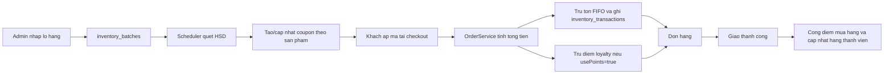

# Tai lieu he thong ma giam gia ton kho va Loyalty tich diem

Ngay cap nhat: 2026-07-07

Nhanh tham chieu: `develop`

Pham vi tai lieu:
- He thong quan ly lo hang, FIFO, hang can han su dung va voucher tu dong.
- He thong Loyalty/tich diem, hang thanh vien, dung diem o checkout va lich su giao dich diem.
- Thay doi database, API, service backend, luong frontend va cac luu y van hanh.

## 1. Muc tieu nghiep vu

He thong duoc bo sung de giai quyet hai nhu cau lon cua AgriMarket:

1. Quan ly ton kho nong san theo lo hang va han su dung.
   - Nong san co vong doi ngan, can uu tien xuat ban lo cu truoc.
   - Hang sap het han can duoc phat hien som de giam ton that.
   - Voucher tu dong giup day hang can han nhung khong hien thi ngon ngu "xa hang" qua truc tiep voi khach.

2. Tang ty le quay lai mua hang bang Loyalty/tich diem.
   - Khach hang duoc tich diem khi don giao thanh cong.
   - Khach hang co the dung diem de giam tien khi checkout.
   - He thong luu lich su diem de giai thich minh bach khi viet bao cao hoac debug.
   - Hang thanh vien co the dung de mo khoa uu dai rieng.

## 2. Tong quan kien truc



Ve mat code:
- Quan ly lo hang va voucher tu dong nam chinh o `InventoryScheduler`, `AdminInventoryServiceImpl`, `OrderServiceImpl`.
- Quan ly ma giam gia nam o `CouponServiceImpl`, `CouponRepository`, `OrderServiceImpl`.
- Loyalty nam o `LoyaltyServiceImpl`, `LoyaltyController`, `OrderServiceImpl`, cac service cap nhat trang thai don.

## 3. Thay doi database

### 3.1. Bang va cot lien quan den ton kho/voucher

Migration lien quan:
- `V10__inventory_and_product_coupons.sql`
- `V11__ensure_inventory_schema.sql`

`V10` bo sung schema chinh. `V11` la migration phong ve, viet theo huong idempotent de dam bao production van co du cot/bang neu truoc do da tung deploy mot phan schema.

Bang `coupons` duoc bo sung:

| Cot | Muc dich |
| --- | --- |
| `product_id` | Neu co gia tri thi voucher chi ap dung cho mot san pham cu the. Neu `NULL` thi la voucher cap don hang hoac freeship. |

Bang `inventory_batches`:

| Cot | Muc dich |
| --- | --- |
| `id` | Khoa chinh cua lo hang. |
| `product_id` | San pham thuoc lo hang. |
| `batch_number` | Ma lo do admin nhap. |
| `import_price` | Gia nhap cua lo. |
| `original_quantity` | So luong nhap ban dau. |
| `remaining_quantity` | So luong con lai trong lo. |
| `manufacture_date` | Ngay san xuat, co the de trong. |
| `expiry_date` | Han su dung, bat buoc co. |
| `created_at`, `updated_at` | Thoi diem tao/cap nhat. |

Bang `inventory_transactions`:

| Cot | Muc dich |
| --- | --- |
| `id` | Khoa chinh giao dich kho. |
| `product_id` | San pham bi tac dong. |
| `batch_id` | Lo hang bi tac dong, co the `NULL` neu khong gan duoc lo. |
| `quantity` | So luong thay doi. Nhap kho la so duong, xuat kho/huy hang la so am. |
| `type` | Loai giao dich, vi du `IMPORT`, `EXPORT_SALE`, `EXPORT_EXPIRED`. |
| `note` | Ghi chu nghiep vu. |
| `created_at` | Thoi diem ghi nhan. |

### 3.2. Bang va cot lien quan den Loyalty

Migration lien quan:
- `V12__loyalty_system.sql`

`V12` duoc viet phong ve bang `INFORMATION_SCHEMA`, vi database demo/production co the da tung chay thu cong mot phan. Nguyen tac la khong sua migration cu da deploy, chi them migration moi.

Bang `users` duoc bo sung:

| Cot | Mac dinh | Muc dich |
| --- | --- | --- |
| `loyalty_points` | `0` | So diem hien co cua khach hang. |
| `membership_tier` | `BRONZE` | Hang thanh vien hien tai. |

Bang `orders` duoc bo sung:

| Cot | Mac dinh | Muc dich |
| --- | --- | --- |
| `points_used` | `0` | So diem da dung trong don hang. |
| `points_earned` | `0` | So diem da cong tu don hang. Cot nay dung de chan cong diem hai lan. |

Bang `loyalty_transactions`:

| Cot | Muc dich |
| --- | --- |
| `id` | Khoa chinh giao dich diem. |
| `user_id` | Khach hang so huu giao dich. |
| `amount` | So diem thay doi. So duong la cong diem, so am la tru diem. |
| `type` | Loai giao dich diem. |
| `note` | Ghi chu de hien thi/debug. |
| `created_at` | Thoi diem ghi nhan. |

Loai transaction dang dung:
- `EARNED_PURCHASE`: cong diem sau don hang thanh cong.
- `EARNED_REVIEW`: cong diem sau khi danh gia san pham hop le.
- `REDEEMED_CHECKOUT`: tru diem khi thanh toan.
- `REFUNDED_CANCELLATION`: hoan diem khi don bi huy/loi/hoan.

## 4. Luong quan ly ton kho FIFO va han su dung

### 4.1. Admin nhap lo hang

Admin tao lo moi qua:

```text
POST /api/admin/inventory/batches
```

Du lieu nhap gom:
- `productId`
- `batchNumber`
- `importPrice`
- `originalQuantity`
- `manufactureDate`
- `expiryDate`

Backend thuc hien:
1. Tim san pham theo `productId`.
2. Tao record `inventory_batches` voi `remaining_quantity = original_quantity`.
3. Ghi `inventory_transactions` voi:
   - `type = IMPORT`
   - `quantity = originalQuantity`
4. Cong them so luong vao `products.stock`.
5. Neu san pham dang `out_of_stock` va stock moi > 0 thi doi lai thanh `in_stock`.

### 4.2. Checkout tru ton theo FIFO

Khi khach checkout, `OrderServiceImpl` khoa cac san pham trong gio hang bang repository update lock, sau do tru ton.

FIFO o day duoc hieu la:
- Lay cac lo con hang va chua het han:

```text
remaining_quantity > 0
expiry_date > now
ORDER BY expiry_date ASC
```

- Lo nao het han som hon se bi tru truoc.
- Moi lan tru lo, backend ghi `inventory_transactions`:

```text
type = EXPORT_SALE
quantity = -so_luong_da_tru
```

- Dong thoi giam `products.stock`.
- Neu stock ve 0 thi doi status san pham thanh `out_of_stock`.

### 4.3. Huy don va hoan ton

Khi don bi huy trong trang thai duoc phep huy:
1. He thong lay cac `order_items`.
2. Cong lai stock san pham.
3. Ghi `inventory_transactions` kieu `IMPORT` voi ghi chu hoan ton tu don huy.
4. Giam `times_used` cua coupon neu don co dung ma.
5. Hoan diem loyalty neu don da dung diem.

Luu y hien tai: phan hoan ton dang cong vao lo con han muon nhat trong danh sach lo kha dung. Neu can chuan ke toan kho hon, co the mo rong `order_items` de luu chi tiet da xuat tu batch nao, tu do huy don hoan dung batch goc.

## 5. Luong quet can han va tu dong tao voucher ton kho

### 5.1. Cach kich hoat

Co hai cach chay quet:

1. Tu dong hang ngay:

```text
@Scheduled(cron = "0 0 1 * * ?")
```

Chay moi ngay luc 01:00.

2. Admin bam nut tren giao dien:

```text
POST /api/admin/inventory/scan
```

Nut nay tuong ung voi thao tac "Quet han su dung & Tu tao Voucher".

### 5.2. Xu ly hang da het han

Scheduler tim cac lo:

```text
expiry_date < now
remaining_quantity > 0
```

Voi moi lo het han:
1. Set `remaining_quantity = 0`.
2. Ghi transaction:

```text
type = EXPORT_EXPIRED
quantity = -expiredQty
```

3. Tru `products.stock`.
4. Neu stock ve 0 thi set product status `out_of_stock`.

### 5.3. Dieu kien tao voucher can han

Scheduler quet tung san pham:

```text
expiry_date > now
expiry_date <= now + 3 ngay
remaining_quantity > 0
ORDER BY expiry_date ASC
```

Dieu kien du de tao/cap nhat voucher:
- Tong so luong can han cua san pham >= `5`.
- San pham co it nhat mot lo can han.
- Voucher tu dong duoc gan `product_id`, tuc chi ap dung cho san pham do.

Neu khong con lo can han hoac tong so luong can han < 5:
- He thong tu dong tat cac voucher ton kho tu dong cua san pham do.
- Viec tat voucher tranh tinh trang ma van hien thi khi khong con hang can han can uu dai.

### 5.4. Quy tac dat ma voucher

He thong khong dung ma dang `XA_HANG_...` nua vi nghe qua truc tiep va kem than thien voi khach.

Ma moi duoc tao theo nhom san pham:

| Nhom san pham | Prefix |
| --- | --- |
| Hai san/thit | `BEP_NHA` |
| Rau/cu/trai cay | `TUOI_NGON` |
| Nhom khac | `MON_NGON` |

Mau code:

```text
<PREFIX>_<TEN_SAN_PHAM_DA_CHUAN_HOA>_<DDMM>
```

Vi du:

```text
BEP_NHA_CA_NGU_LAM_SACH_0907
TUOI_NGON_RAUXALACH_0807
MON_NGON_SAN_PHAM_0807
```

Ten san pham duoc chuan hoa:
- Bo dau tieng Viet.
- Doi sang chu hoa.
- Thay ky tu dac biet/khoang trang bang `_`.
- Gioi han do dai token san pham de ma khong qua dai.

### 5.5. Quy tac tinh muc giam

Voucher co the la giam theo so tien co dinh hoac giam theo phan tram.

Ngay can het han duoc tinh theo lo can han som nhat.

Quy tac dang chay:

| Dieu kien | Muc giam |
| --- | --- |
| Rau/trai cay co gia <= 60.000d | Giam co dinh 12.000d neu con <=1 ngay, 10.000d neu con <=2 ngay, 8.000d neu con <=3 ngay. |
| San pham gia <= 40.000d | Giam co dinh 10.000d neu con <=1 ngay, 8.000d neu con <=2 ngay, 5.000d neu con <=3 ngay. |
| Hai san/thit gia cao hon nguong tren | Giam 35% neu con <=1 ngay, 30% neu con <=2 ngay, 25% neu con <=3 ngay. |
| Rau/trai cay gia cao hon nguong tren | Giam 30% neu con <=1 ngay, 25% neu con <=2 ngay, 20% neu con <=3 ngay. |
| Nhom khac | Giam 25% neu con <=1 ngay, 20% neu con <=2 ngay, 15% neu con <=3 ngay. |

Voi giam co dinh, he thong cap muc giam toi da bang 40% gia ban san pham de tranh giam qua sau voi san pham gia thap.

### 5.6. Thong tin voucher duoc tao

Voucher tu dong co cac thuoc tinh:

| Truong | Gia tri |
| --- | --- |
| `couponType` | `PRODUCT_DISCOUNT` |
| `discountType` | `PERCENTAGE` hoac `FIXED_AMOUNT` |
| `productId` | ID san pham can han |
| `minOrderValue` | `0` |
| `startsAt` | Thoi diem quet |
| `expiresAt` | Han su dung cua lo can han som nhat |
| `usageLimit` | Tong so luong can han cua san pham |
| `active` | `true` neu san pham con du dieu kien |

He thong se tai su dung voucher tu dong cu neu tim thay. Cac ma cu hoac ma trung lap se duoc tat de moi san pham chi co mot campaign ton kho dang hoat dong.

## 6. Luong ap voucher trong checkout

### 6.1. Preview checkout

Frontend goi preview de backend tinh truoc:
- Tong tien hang.
- Phi giao hang.
- Muc giam voucher.
- Muc giam diem loyalty.
- Tong tien cuoi cung.
- Canh bao neu gio hang hoac ma giam gia khong hop le.

Response co cac truong quan trong:

| Truong | Muc dich |
| --- | --- |
| `subtotal` | Tien hang truoc giam. |
| `couponDiscountAmount` | So tien giam rieng tu voucher. |
| `pointsDiscount` | So tien giam rieng tu diem. |
| `discountAmount` | Tong giam = voucher + diem. |
| `pointsUsed` | So diem du kien dung. |
| `shippingFee` | Phi giao hang sau khi ap freeship neu co. |
| `totalPrice` | Tong thanh toan cuoi cung. |

Preview khong tang `times_used` cua coupon va khong tru diem. No chi tinh truoc de hien thi cho khach.

### 6.2. Validate coupon

Khi co `couponCode`, backend kiem tra:
- Ma co ton tai.
- `active = true`.
- Da den `startsAt` neu co.
- Chua qua `expiresAt` neu co.
- Chua het `usageLimit`.
- Don dat `minOrderValue` neu ma co cau hinh.
- Neu la `PRODUCT_DISCOUNT`, gio hang phai co dung san pham `productId`.
- Neu la ma theo hang thanh vien, user phai dat hang tuong ung.

Tier-only coupon dang co logic:
- `GOLD5`: chi `GOLD` hoac `PLATINUM` dung duoc.
- `PLATINUM10`: chi `PLATINUM` dung duoc.

### 6.3. Tinh tien giam

Voi `ORDER_DISCOUNT`:
- Giam tren toan bo `subtotal`.

Voi `PRODUCT_DISCOUNT`:
- Chi tinh tren tong tien cua san pham co `productId` khop.
- Vi du cart co ca ca ngu va rau, ma `BEP_NHA_CA_NGU...` chi giam tren dong ca ngu.

Voi `FREESHIP`:
- `discountAmount = 0`.
- `shippingFee = 0`.

Tat ca discount deu duoc cap khong vuot qua `eligibleAmount`, nen khong co tinh trang tien giam lon hon tien hang duoc ap dung.

### 6.4. Checkout chinh thuc

Khi khach bam tao don:
1. Backend khoa san pham de tranh ban vuot ton.
2. Backend khoa coupon theo code bang `PESSIMISTIC_WRITE`.
3. Backend validate lai coupon, khong tin vao preview frontend.
4. Backend tinh lai `subtotal`, `shippingFee`, `couponDiscountAmount`, `pointsDiscount`, `totalPrice`.
5. Neu dung diem, backend tru diem that va lay so diem thuc te da tru.
6. Tao `orders`, `order_items`, `payments`.
7. Tang `coupon.times_used`.
8. Tru ton FIFO va ghi transaction kho.
9. Xoa gio hang.
10. Tao notification/email xac nhan neu luong thanh toan phu hop.

Nguyen tac quan trong: checkout la server-authoritative. Frontend chi hien thi, con ket qua cuoi cung do backend tinh va luu.

## 7. Luong Loyalty/tich diem

### 7.1. Quy tac diem

| Quy tac | Gia tri |
| --- | --- |
| Ty le quy doi | 1 diem = 1 VND |
| Gioi han dung diem checkout | Toi da 20% tien hang (`subtotal`) |
| Diem mua hang | 1% tong tien don hang sau giam va phi ship (`totalPrice`) |
| Diem danh gia | 200 diem moi danh gia hop le |

Vi du:
- Khach co 100.000 diem.
- Gio hang subtotal 300.000d.
- Diem toi da duoc dung = 20% * 300.000 = 60.000 diem.
- Neu bat dung diem, preview hien `pointsUsed = 60000`, `pointsDiscount = 60000`.

### 7.2. Dung diem tai checkout

Frontend gui:

```json
{
  "shippingAddressId": 1,
  "paymentMethod": "cash",
  "couponCode": "BEP_NHA_CA_NGU_LAM_SACH_0907",
  "usePoints": true
}
```

Backend xu ly:
1. Lay diem hien co cua user.
2. Tinh gioi han 20% subtotal.
3. `pointsToRedeem = min(userPoints, floor(subtotal * 20%))`.
4. Khi checkout chinh thuc, goi `deductPointsForCheckout`.
5. Service khoa user bang pessimistic lock.
6. Tru so diem thuc te co the tru.
7. Ghi `loyalty_transactions`:

```text
type = REDEEMED_CHECKOUT
amount = -pointsUsed
```

8. Luu `orders.points_used = pointsUsed`.

Ly do phai lay so diem thuc te da tru:
- Trong luc user dang checkout, diem co the thay doi boi luong khac.
- Backend khong luu theo uoc tinh cua frontend, ma luu theo ket qua tru diem thuc te.

### 7.3. Cong diem mua hang

Khi don giao thanh cong, cac luong sau co the goi cong diem:
- Admin cap nhat don sang `delivered`.
- Tai khoan delivery cap nhat don giao thanh cong.
- GHN webhook bao giao thanh cong.
- Khach xac nhan hoan tat don sau khi da giao.

Service `awardPointsForPurchase` xu ly:
1. Khoa order bang `findByIdForUpdate`.
2. Neu `orders.points_earned > 0` thi bo qua de tranh cong lap.
3. Khoa user.
4. Tinh diem:

```text
points = floor(order.totalPrice * 0.01)
```

5. Cong diem vao `users.loyalty_points`.
6. Luu `orders.points_earned`.
7. Ghi `loyalty_transactions`:

```text
type = EARNED_PURCHASE
amount = points
```

8. Goi lai tinh hang thanh vien.

### 7.4. Hoan diem khi huy/loi don

Neu don da dung diem va sau do bi huy, loi giao, hoan, mat/hong theo webhook:
1. Backend kiem tra `orders.points_used > 0`.
2. Cong lai diem cho user.
3. Ghi `loyalty_transactions`:

```text
type = REFUNDED_CANCELLATION
amount = pointsUsed
```

Luong hoan diem duoc gan vao cac diem cap nhat trang thai:
- Khach huy don hop le.
- Admin huy don.
- Delivery cap nhat that bai va don bi huy.
- GHN webhook bao trang thai huy/hoan/loi can hoan diem.

### 7.5. Cong diem danh gia

Khi khach tao review hop le:
1. Review duoc validate va luu.
2. `LoyaltyService.awardPointsForReview` cong 200 diem.
3. Ghi `loyalty_transactions`:

```text
type = EARNED_REVIEW
amount = 200
```

## 8. Hang thanh vien

Hang thanh vien duoc luu o `users.membership_tier`.

Nguong hien tai:

| Hang | Tong chi tieu 365 ngay |
| --- | --- |
| `BRONZE` | Mac dinh |
| `SILVER` | Tu 1.000.000d |
| `GOLD` | Tu 5.000.000d |
| `PLATINUM` | Tu 15.000.000d |

Moi lan cong diem mua hang, backend goi `recalculateMembershipTier`.

Luu y ky thuat:
- Query hien tai tinh tong chi tieu theo cac don co status `delivered` trong 365 ngay.
- Neu trong tuong lai team quy uoc `completed` moi la trang thai doanh thu cuoi cung, nen mo rong query de tinh ca `completed`, tranh viec don da hoan tat nhung khong con nam trong tap `delivered`.

## 9. API lien quan

### 9.1. Admin Inventory

| Method | Endpoint | Muc dich |
| --- | --- | --- |
| `GET` | `/api/admin/inventory/summary` | Tong quan ton kho. |
| `GET` | `/api/admin/inventory/alerts` | Danh sach san pham sap het/hiet hang. |
| `PATCH` | `/api/admin/inventory/products/{productId}/stock` | Set stock truc tiep. |
| `PATCH` | `/api/admin/inventory/products/{productId}/stock/adjust` | Tang/giam stock. |
| `GET` | `/api/admin/inventory/batches` | Danh sach lo hang. |
| `POST` | `/api/admin/inventory/batches` | Nhap lo moi. |
| `GET` | `/api/admin/inventory/transactions` | Nhat ky xuat nhap kho. |
| `POST` | `/api/admin/inventory/scan` | Quet hang het han/can han va tao voucher. |

### 9.2. Coupon

| Method | Endpoint | Muc dich |
| --- | --- | --- |
| `GET` | `/api/admin/coupons` | Admin xem danh sach ma. |
| `POST` | `/api/admin/coupons` | Admin tao ma. |
| `GET` | `/api/admin/coupons/{couponId}` | Admin xem chi tiet ma. |
| `PUT` | `/api/admin/coupons/{couponId}` | Admin cap nhat ma. |
| `PATCH` | `/api/admin/coupons/{couponId}/status` | Bat/tat ma. |
| `DELETE` | `/api/admin/coupons/{couponId}` | Xoa ma. |
| `GET` | `/api/public/coupons` | Khach xem ma dang kha dung. |
| `GET` | `/api/public/coupons/validate?code=...` | Kiem tra ma. |

### 9.3. Loyalty

| Method | Endpoint | Muc dich |
| --- | --- | --- |
| `GET` | `/api/customer/loyalty/transactions` | Khach xem lich su giao dich diem. |

Loyalty checkout dung chung request checkout:

| Field | Muc dich |
| --- | --- |
| `couponCode` | Ma giam gia neu co. |
| `usePoints` | `true` neu khach muon dung diem. |

## 10. UI/Frontend hien thi

Frontend can/hien da dung cac du lieu sau:

### Trang admin kho

Chuc nang:
- Xem danh sach lo hang.
- Xem NSX/HSD, so luong goc/con lai.
- Nhan biet lo can han.
- Bam "Quet han su dung & Tu tao Voucher".
- Xem nhat ky xuat/nhap kho.

### Trang admin ma giam gia

Chuc nang:
- Xem tong so ma.
- Loc ma dang bat, het han, da dung.
- Bat/tat/sua/xoa ma.
- Ma tu dong co the hien nhu ma thuong, nhung `couponType = PRODUCT_DISCOUNT` va co `productId`.

### Trang checkout

Chuc nang:
- Hien tien hang.
- Hien giam gia voucher rieng.
- Hien giam gia diem rieng.
- Hien phi giao hang.
- Hien tong thanh toan cuoi.
- Cho chon dung diem neu user co diem.

### Trang ho so khach hang

Chuc nang:
- Hien diem hien co.
- Hien hang thanh vien.
- Co the mo rong hien lich su diem tu `/api/customer/loyalty/transactions`.

## 11. Cac tinh huong va cach he thong xu ly

### Tinh huong 1: San pham can han con 6 don vi

1. Admin nhap lo ca ngu HSD trong 2 ngay, con 6 san pham.
2. Admin bam quet hoac doi job 1 gio sang.
3. He thong tao ma:

```text
BEP_NHA_CA_NGU_LAM_SACH_0907
```

4. Voucher gan `productId` cua ca ngu.
5. Khach mua ca ngu va nhap ma.
6. Voucher chi giam tien tren dong ca ngu, khong giam san pham khac trong gio.

### Tinh huong 2: San pham can han con duoi 5 don vi

1. Scheduler tinh tong near-expiry stock < 5.
2. He thong tat voucher tu dong cua san pham do.
3. Khach khong nen thay ma hoat dong nua.

### Tinh huong 3: Khach dung diem roi huy don

1. Checkout tru diem va luu `orders.points_used`.
2. Don bi huy hop le.
3. Backend hoan lai dung so diem da dung.
4. Luu transaction `REFUNDED_CANCELLATION`.
5. Stock va coupon usage cung duoc hoan/nhuong lai.

### Tinh huong 4: Nhieu nguon cung bao don da giao

Don co the duoc cap nhat tu admin, delivery noi bo, khach, hoac GHN webhook.

Rui ro: cong diem lap.

Cach xu ly:
- `awardPointsForPurchase` khoa order.
- Neu `points_earned > 0`, service bo qua.
- Vi vay mot don chi duoc cong diem mua hang mot lan.

## 12. Cac loi da gap va cach fix

| Van de | Cach xu ly |
| --- | --- |
| Ma tu dong cu co dang `XA_HANG_...`, nghe thieu chuyen nghiep. | Doi sang prefix than thien: `BEP_NHA`, `TUOI_NGON`, `MON_NGON`. |
| Voucher duoc tao khi so luong can han qua it. | Giu nguong toi thieu 5 san pham can han moi tao voucher. Duoi nguong thi tat voucher cu. |
| Discount co dinh co the qua lon voi san pham gia thap. | Cap giam co dinh toi da 40% gia san pham. |
| Co the co nhieu voucher tu dong cung mot san pham. | Reuse voucher cu va tat duplicate. |
| Preview checkout co the tinh diem khac voi luc checkout that. | Checkout chinh thuc dung so diem thuc te `deductPointsForCheckout` tra ve. |
| Cong diem co the lap khi don duoc cap nhat tu nhieu luong. | Khoa order va chan neu `points_earned > 0`. |
| API lich su diem neu tra entity truc tiep co nguy co loi serialize lazy object. | Dung `LoyaltyTransactionResponse` DTO. |
| Migration cu da deploy neu sua lai co the loi checksum Flyway. | Khong sua migration cu, them `V12` moi cho loyalty va `V11` phong ve schema inventory. |

## 13. Kiem thu va xac minh

Test lien quan:
- `InventorySchedulerTest`
  - Tao voucher than thien cho san pham du dieu kien.
  - Tat voucher legacy/auto khi ton can han duoi nguong.
- `CouponServiceImplTest`
  - Validate tao/sua/bat tat/xoa coupon.
- `OrderServiceImplTest`
  - Checkout, coupon, tru stock, hoan stock, tinh tong.
- `LoyaltyServiceImplTest`
  - Cong diem, tru diem, hoan diem, tinh hang.
- `OrderControllerTest`, `AdminOrderManagementControllerTest`
  - Kiem tra API order va status flow.

Lenh kiem thu da dung trong qua trinh tich hop:

```powershell
cd D:\agri-ecommerce\agri-ecommerce-backend
.\mvnw.cmd test
```

```powershell
cd D:\agri-ecommerce\agri-ecommerce-frontend
npm run build
```

Ket qua da ghi nhan trong log truoc do:
- Backend test pass.
- Frontend production build pass.
- Production deploy/smoke test da duoc kiem tra trong cac dot fix gan day.

## 14. Gia tri cho bao cao thuc tap

Co the trinh bay module nay theo ba lop:

1. Lop nghiep vu:
   - Giam that thoat nong san can han.
   - Tang ty le mua lai bang loyalty.
   - Khuyen mai co dieu kien, khong giam gia tran lan.

2. Lop ky thuat:
   - FIFO theo `expiry_date`.
   - Scheduler tu dong va endpoint admin trigger.
   - Coupon gan `product_id`.
   - Checkout server-authoritative.
   - Pessimistic locking de tranh race condition.
   - Ledger `loyalty_transactions` de audit diem.

3. Lop du lieu:
   - Them bang lo hang va giao dich kho.
   - Mo rong coupon cho san pham cu the.
   - Mo rong user/order cho loyalty.
   - Luu moi bien dong diem thanh transaction rieng.

## 15. Huong mo rong de he thong chuyen nghiep hon

1. Combo/meal-kit:
   - Nen la module rieng, khong chi la coupon.
   - Can bang bundle gom nhieu san pham thanh phan va ty le tru kho tung san pham.
   - Vi du combo lau hai san gom ca, tom, rau, nam; checkout phai tru ton cua tung thanh phan.

2. Hoan ton dung batch goc:
   - Hien tai khi huy don, stock duoc hoan vao lo kha dung muon nhat.
   - De chinh xac tuyet doi, can luu chi tiet batch da xuat cho tung order item.

3. Mo rong membership tier:
   - Co the tinh ca `delivered` va `completed` tuy dinh nghia doanh thu cuoi cung.
   - Co the them quyen loi tier: freeship, nhan doi diem, early access coupon.

4. Dashboard hieu qua voucher ton kho:
   - So luong voucher auto da tao.
   - Ti le su dung voucher.
   - So luong hang can han da ban duoc.
   - Gia tri ton that tranh duoc.

5. Chong spam diem review:
   - Co the chi cong diem mot lan moi san pham moi don hang.
   - Co the them gioi han diem review moi ngay.

## 16. Cap nhat hoan thien 2026-07-07

### 16.1. Coupon thuc te va khong chong voucher

Van de gap phai:
- Frontend checkout tung cho phep luu nhieu coupon va gui len backend theo dang chuoi phan cach dau phay.
- Backend co logic cong don nhieu coupon, de dan toi rui ro giam gia chong cheo va kho giai thich trong bao cao.

Huong xu ly:
- Checkout chi gui mot `couponCode` duy nhat: `appliedCoupons[0]?.code`.
- Khi khach chon ma moi, frontend thay the ma dang ap dung thay vi cong them.
- Backend chan request co dau phay trong `OrderServiceImpl.calculateCoupon` va `calculateCouponPreview`.
- Loyalty points van duoc dung kem voucher vi day la so du diem cua khach, duoc ghi nhan bang `pointsUsed` va `loyalty_transactions`, khac voi viec stack nhieu voucher.

Ket qua nghiep vu:
- Moi don hang co toi da 1 voucher.
- Tong giam gia van minh bach: `couponDiscountAmount` + `pointsDiscount`.
- Du lieu `orders.coupon_code` sach va de audit.

### 16.2. Chuan hoa ma coupon can han

Van de gap phai:
- Mot so ma cu dang co ten truc dien nhu `XA_HANG_*`, khong than thien voi khach.

Huong xu ly:
- `InventoryScheduler` tiep tuc tao ma theo chien dich mem hon:
  - `TUOI_NGON_*` cho rau/cu/qua.
  - `BEP_NHA_*` cho nhom ca/thit/hai san.
  - `MON_NGON_*` cho nhom khac.
- Them migration `V16__professionalize_auto_coupon_codes.sql` de doi cac ma legacy `XA_HANG_%` sang `TUOI_NGON_<productId>_<couponId>`.
- Checkout frontend bo sung label hien thi cho cac prefix tren.

### 16.3. Review co anh thuc te

Thay doi database:
- Them migration `V15__add_review_image_url.sql`.
- Bang `reviews` co them cot `image_url VARCHAR(1024) NULL`.

Thay doi backend:
- `ReviewEntity`, `ReviewRequest`, `ReviewUpdateRequest`, `ReviewResponse`, `ReviewMapper` bo sung `imageUrl`.
- `ReviewServiceImpl` validate `imageUrl` phai la URL `http/https`.
- Them `CustomerUploadController`:
  - Endpoint: `POST /api/customer/uploads/review-images`.
  - Role: `CUSTOMER`.
  - File hop le: JPG, PNG, WEBP, toi da 5MB.
  - Upload len Cloudinary folder `agri-ecommerce/reviews`.

Thay doi frontend:
- `review.service.js` them `uploadReviewImage(file)`.
- Trang profile/order history cho khach upload anh khi viet danh gia.
- Anh duoc upload truoc len Cloudinary, sau do submit review gui `imageUrl`.
- Trang chi tiet san pham hien thi anh trong tung review neu co.

### 16.4. Email xac nhan va hoa don

Van de gap phai:
- Email invoice truoc do chi gom mot dong "Khuyen mai", chua noi ro ma voucher va xu tich luy.

Huong xu ly:
- `EmailServiceImpl.buildInvoiceText` bo sung:
  - Ma giam gia neu co.
  - Xu da dung neu co.
  - Xu du kien nhan khi don hoan tat.
- `buildInvoiceHtml` bo sung cac dong tuong ung trong phan tong ket thanh toan.
- Xu du kien duoc tinh theo cung cong thuc loyalty hien tai: 1% tong thanh toan.

Ket qua:
- Khach nhan email co the biet don da dung ma nao, dung bao nhieu xu, va se nhan bao nhieu xu khi don hoan tat.
- Phu hop de chup minh chung trong bao cao va demo.
